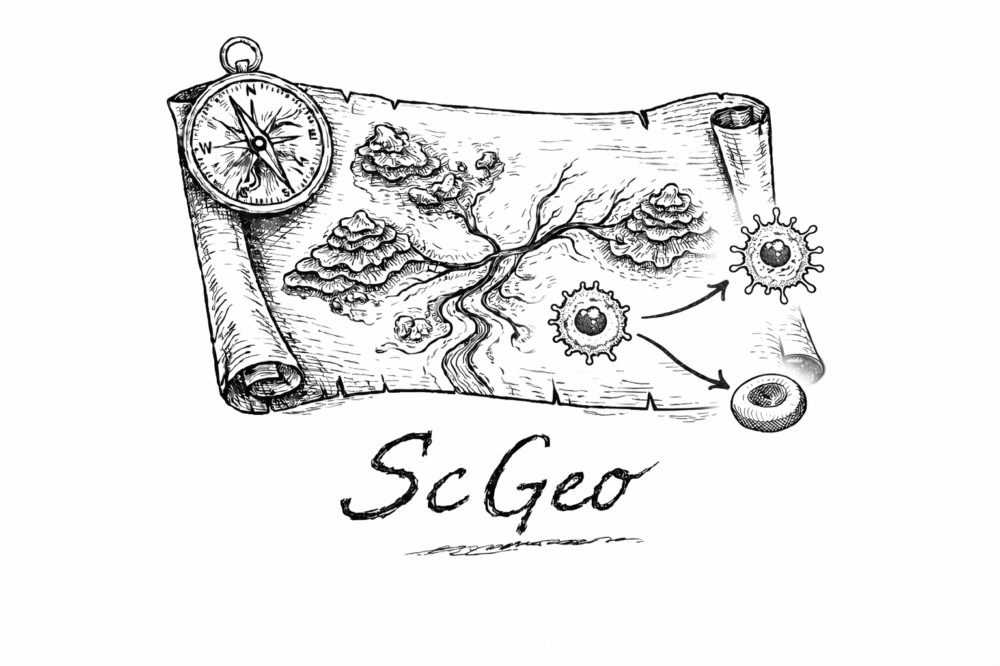

<p align="center">
  
</p>

<h1 align="center">ScGeo</h1>

<p align="center">
Geometry-aware analysis of single-cell representations
</p>


ScGeo is a geometry-aware framework for single-cell analysis that treats low-dimensional embeddings as quantitative representations of cellular state space.

It enables:

- measurement of perturbation-driven state transitions (Δ-shift)
- evaluation of integration via local mixing structure
- detection of global redistribution (distributional divergence)
- alignment of embedding geometry with RNA velocity and fate inference

Importantly, ScGeo reveals structured biological dynamics and non-canonical trajectories that are not fully captured by RNA velocity alone.

ScGeo provides a quantitative framework to detect, compare, and interpret perturbation-induced state transitions directly in embedding space.

## Installation

```bash
git clone https://github.com/liuifrec/scgeo.git
cd scgeo
conda env create -f environment.yml
conda activate scgeo
pip install -e .
```

## Minimal example

```python
import scgeo as sg

# compute geometry
sg.tl.shift(adata)
sg.tl.robust_shift(
    adata,
    condition_key="condition",
    group0="control",
    group1="treated",
    sample_key="donor",
)
sg.tl.representation_stability(
    adata,
    reps=["X_pca", "X_scvi"],
    node_key="cell_type",
    condition_key="condition",
    group0="control",
    group1="treated",
    sample_key="donor",
)
sg.tl.local_geometry_stability(
    adata,
    reps=["X_pca", "X_scvi"],
    node_key="cell_type",
    sample_key="donor",
    k_values=(15, 30),
)
report = sg.get.state_report(adata, node_key="cell_type")
sg.pl.state_evidence_panel(report)
sg.pl.representation_stability_heatmap(adata)
sg.pl.consensus_state_map(adata, node_key="cell_type")
bundle = sg.pl.perturbation_report(adata, node_key="cell_type")
sg.tl.mixscore(adata)
sg.tl.distribution_test(adata)

# analyze dynamics
sg.tl.velocity_shift_alignment(adata)

# visualize
sg.pl.recovery_compass(adata)
```

## How to read a ScGeo report

ScGeo reports are organized around four questions:

| Term | Question | Evidence shown |
|------|----------|----------------|
| Effect | Did the state move? | robust displacement magnitude, normalized magnitude, bootstrap interval, directional stability |
| Stability | Is that conclusion stable across representations? | usable representation fraction, consensus label, rank spread, leave-one-representation-out sensitivity |
| Local geometry | Is neighborhood structure preserved or distorted? | neighbor overlap, neighbor Jaccard, local-shape distortion, global-scale-normalized distortion, k values used, median and worst-case representation-pair summaries |
| Dynamics | Does the displacement agree with inferred dynamics? | within-representation displacement-velocity cosine and aligned/discordant/neutral fractions |
| Coverage | Is the conclusion adequately supported? | cell/sample counts, underpowered states, missing modules, warning text |

`scgeo.get.state_report` returns one row per state and adds transparent reason
codes such as `stable_across_representations`, `representation_sensitive`,
`dynamics_aligned`, `dynamics_discordant`, `dynamics_unavailable`, and
`insufficient_coverage`. Report summaries stay quantitative unless a qualitative
label is already defined by a stored analysis module. These labels are not a
weighted score or a new significance statistic.

The report metadata records the comparison label, condition groups, source
store keys, representations, k values, sample key, center estimator, bootstrap
unit, consensus rules, global diagnostics, representation diagnostics, warnings,
and creation timestamp. State-graph summaries remain global diagnostics unless
a stored analysis provides a genuinely state-specific transition-profile metric.

Small synthetic example:

```python
import anndata as ad
import numpy as np
import pandas as pd
import scgeo as sg

rng = np.random.default_rng(0)
n = 40
x0 = rng.normal(scale=0.2, size=(n, 2))
x1 = rng.normal(loc=(1.0, 0.0), scale=0.2, size=(n, 2))
x = np.vstack([x0, x1])
obs = pd.DataFrame(
    {
        "condition": ["control"] * n + ["treated"] * n,
        "state": ["state_a"] * (2 * n),
        "donor": [f"d{i % 4}" for i in range(2 * n)],
    },
    index=[f"cell{i}" for i in range(2 * n)],
)
adata = ad.AnnData(X=np.zeros((2 * n, 1)), obs=obs)
adata.obsm["X_pca"] = x
adata.obsm["X_rot"] = x @ np.array([[0.0, -1.0], [1.0, 0.0]])
adata.obsm["X_umap"] = x
adata.obsm["V_pca"] = np.repeat([[1.0, 0.0]], 2 * n, axis=0)
adata.obsm["V_rot"] = adata.obsm["V_pca"] @ np.array([[0.0, -1.0], [1.0, 0.0]])

sg.tl.robust_shift(
    adata,
    rep="X_pca",
    condition_key="condition",
    group0="control",
    group1="treated",
    by="state",
    sample_key="donor",
    n_boot=50,
)
sg.tl.representation_stability(
    adata,
    reps=["X_pca", "X_rot"],
    node_key="state",
    condition_key="condition",
    group0="control",
    group1="treated",
    sample_key="donor",
    velocity_keys={"X_pca": "V_pca", "X_rot": "V_rot"},
    min_cells=10,
    n_boot=25,
)
sg.tl.local_geometry_stability(
    adata,
    reps=["X_pca", "X_rot"],
    node_key="state",
    sample_key="donor",
    k_values=(10,),
    n_boot=25,
)

report = sg.get.state_report(adata, node_key="state")
sg.pl.state_evidence_panel(report)
bundle = sg.pl.perturbation_report(
    adata,
    node_key="state",
    report=report,
    comparison_label="treated_vs_control",
    save_dir="scgeo_report",
    show=False,
)
```


## Core questions ScGeo answers

| Question                                  | Geometric tool              |
|-------------------------------------------|-----------------------------|
| How different are two conditions overall? | Wasserstein distance        |
| How much do populations overlap?          | Bhattacharyya / kNN mixing  |
| Are two responses aligned?                | cosine(Δ₁, Δ₂)              |
| Which cells drive the difference?         | consensus subspace          |
| Where are ambiguous cells?                | projection disagreement     |

ScGeo complements Scanpy, scVelo, CellRank, and scFates by making
**representation geometry explicit and measurable**.

## Synthetic benchmarks

ScGeo includes a synthetic-only benchmark framework under `scgeo.bench`.
It is designed to test whether the analysis stack separates effect magnitude,
abundance change, distributional shape change, local geometric distortion,
representation stability, uncertainty, and geometry-dynamics agreement.

```python
import scgeo as sg

adata = sg.bench.simulate_perturbation_geometry(
    scenario="outlier_contamination",
    n_states=5,
    n_samples_per_condition=3,
    cells_per_sample=200,
    seed=0,
)

# Run the analysis stack, then evaluate against stored synthetic truth.
sg.tl.robust_shift(
    adata,
    rep="X_truth",
    condition_key="condition",
    group0="control",
    group1="treated",
    by="state",
    sample_key="sample",
    n_boot=50,
)
results = sg.bench.evaluate_ground_truth(adata)
results["state_metrics"].head()

# Or run a predefined reproducible suite.
suite = sg.bench.run_simulation_suite(
    profile="smoke",
    scenarios=["null", "outlier_contamination"],
    output_dir="scgeo_simulation_benchmark",
)

# Explicit framework ablation, summarized on held-out evaluation seeds.
ablation = suite["tables"]["framework_ablation"]
fig = sg.bench.plot_framework_ablation(ablation, split="evaluation", show=False)
```

Profiles:

| Profile | Approximate cells per job | Seeds | Bootstrap | k values | Rank subset |
|---------|---------------------------|-------|-----------|----------|-------------|
| smoke | 1,000-2,000 | 2 total | 25 | 15 | 750 |
| quick | 3,000-5,000 | 5 total | 100 | 15, 30 | 1,500 |
| manuscript | 5,000-10,000 | 20 total | 300 | 15, 30, 50 | 3,000 |

Calibration seeds and held-out evaluation seeds are tracked separately in every
suite result table. Calibration runs may be used to explore thresholds, but
final reported performance should come from held-out evaluation seeds. The
suite exports threshold-sensitivity tables; it does not modify ScGeo consensus
thresholds automatically.

The framework ablation compares:

| Variant | Evidence included |
|---------|-------------------|
| A | original mean shift on `X_truth` |
| B | robust geometric-median shift on `X_truth` |
| C | B plus representation-consensus status |
| D | C plus local-geometry diagnostics |
| E | D plus dynamics agreement |

The ablation table reports, for every synthetic scenario and failure mode,
whether each variant detects the failure correctly, misses it, falsely calls it,
or marks the evidence as insufficient, unstable, unavailable, or not computed.
It is intentionally not a composite score.

Simulation benchmarks are not experimental validation. They support claims
about expected behavior under controlled synthetic perturbations and failure
modes, not claims about biological truth in real datasets.

## Mapping to manuscript concepts

| Manuscript concept | API |
|-------------------|-----|
| Geometric displacement (Δ) | scgeo.tl.shift |
| Local mixing | scgeo.tl.mixscore |
| Distribution divergence | scgeo.tl.distribution_test |
| Geometry–velocity alignment | scgeo.tl.velocity_shift_alignment |
| OOD detection | scgeo.tl.ood_cells |
| Composition drift | scgeo.pl.composition_drift |
| Recovery trajectory visualization | scgeo.pl.recovery_compass |

## Core functions

- `scgeo.tl.shift` — geometric displacement between conditions
- `scgeo.tl.mixscore` — local neighborhood mixing
- `scgeo.tl.distribution_test` — embedding-level divergence
- `scgeo.tl.velocity_shift_alignment` — geometry–velocity consistency


## Core Features (v0.2)

- Geometry-aware reference mapping (Census / local)
- Velocity–embedding alignment metrics
- Driver gene identification via geometric shift
- OOD detection in embedding space

## Extended capabilities (ongoing development)
- QC-aware atlas mapping & annotation
- cellxgene reference pool integration
- batch correction benchmarking
- trajectory / velocity / fate geometry
- cross-modality (scRNA / spatial / bulk) analysis

## Manuscript

ScGeo is introduced and validated in:

"ScGeo reveals non-canonical trajectories beyond RNA velocity in radiation-induced hematopoietic recovery"

All analysis workflows and figure-generation notebooks are available in:
https://github.com/liuifrec/scgeo-notebooks


## Citation

If you use ScGeo, please cite:

Liu Y-C, Yoshida K.  
*ScGeo reveals non-canonical trajectories beyond RNA velocity in radiation-induced hematopoietic recovery.*

## Manifest layers (reproducible contracts)

ScGeo tracks public and I/O contracts across three aligned JSON manifests:

- `api_manifest.json`: exported public API (`scgeo.tl`, `scgeo.pl`, and `scgeo.get`)
- `scgeo_io_raw.json`: raw write-diff observations for TL functions
- `scgeo_io_manifest.json`: normalized TL I/O contract

Rebuild all manifests in one step:

```bash
PYTHONPATH=. python scripts/rebuild_manifests.py
```

Validate the alignment/importability checks:

```bash
PYTHONPATH=. python scripts/validate_manifests.py
```

Public API docs generated from these manifests are available at:

- `docs/api_reference.md`
